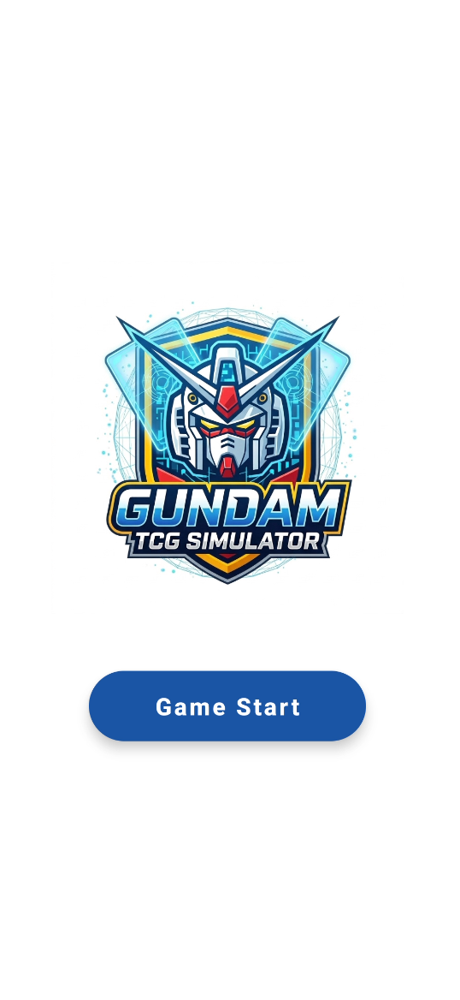
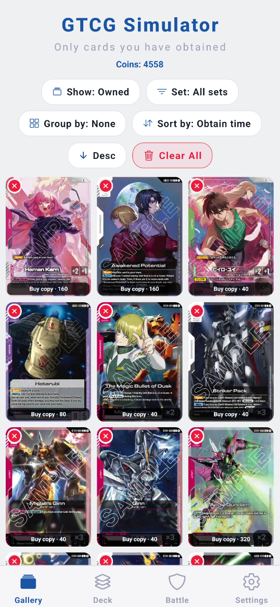
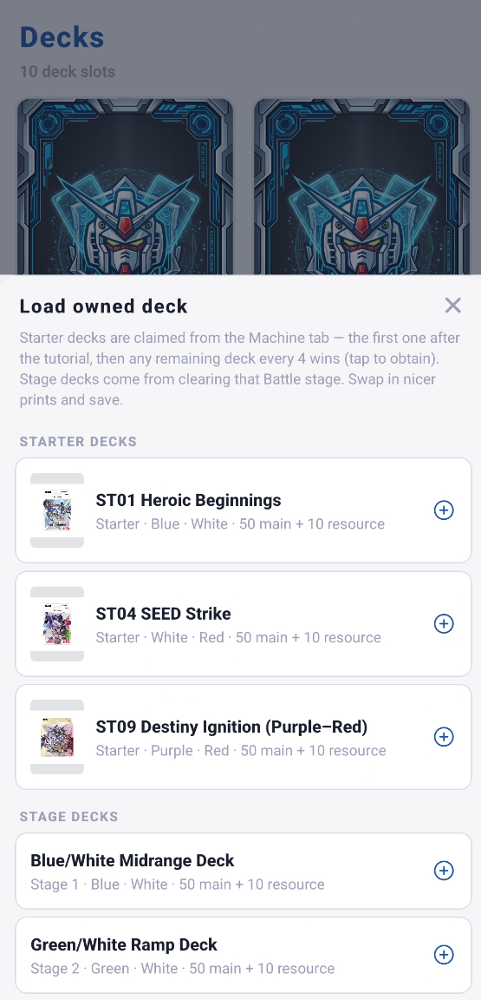
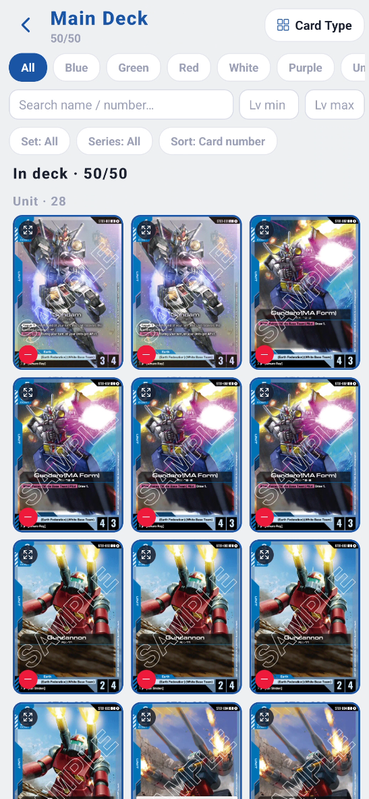
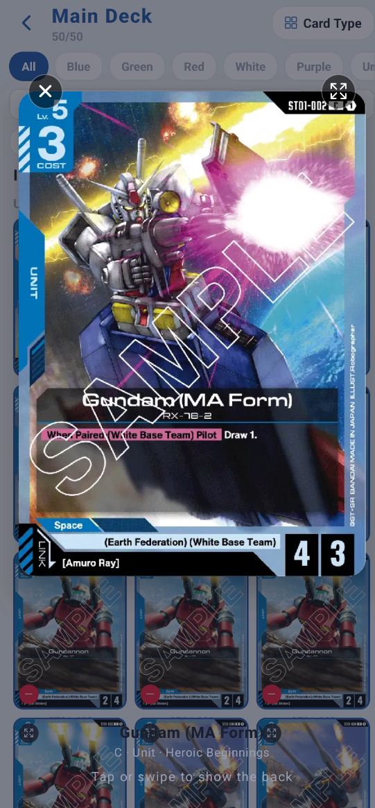
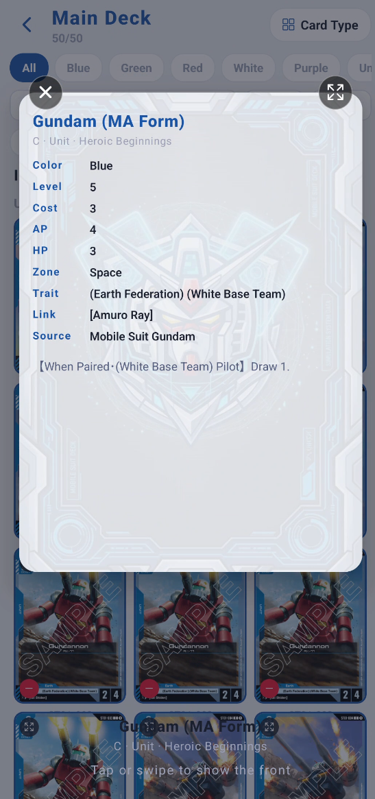
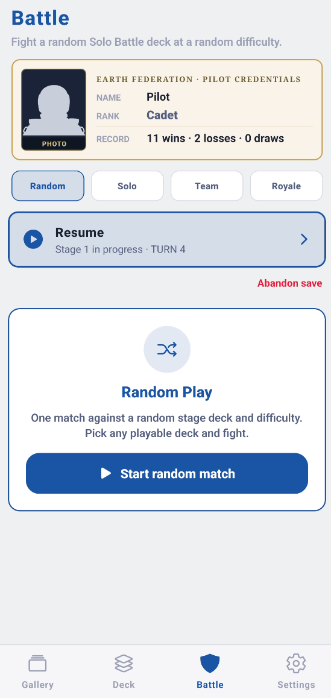
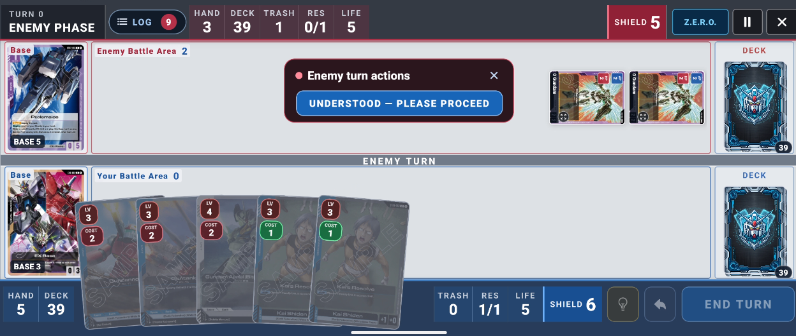

# GTCG Simulator

A phone app for looking through the cards you have, building a deck, and playing practice battles. It is an independent fan project. It is not made by, endorsed by, or connected to Bandai or the official Gundam card game.

## Install the app

Ask to join the googlegroups gtcg-simulator@googlegroups.com or you can get the app from the below test address, or install the APK from this repository.

### Play on an Android phone (Google Play)

Open the Play Store listing and install the app on your phone:

[Google Play Release][https://play.google.com/apps/internaltest/4701170075266031100]

### Or install the APK from this repository

The Android install file is `app-release.apk` (about 146 MB) in the release section, you can follow the step below: 

1. Open the [Releases](https://github.com/whisley0/GTCG-Simulator/releases) page and download `app-release.apk`.
2. Copy the file onto the phone if you did not download it there. A USB cable, Google Drive, or a message to yourself all work.
3. On the phone, open the **Files** app and tap `app-release.apk`.
4. If Android says the install is blocked, allow installs from that app. The prompt usually offers **Settings**. Turn on **Allow from this source**, then go back and tap the file again.
5. Tap **Install**, then **Open**.

## Title Screen

After pressing start, you will be landed on **Battle**. The four buttons along the bottom are **Gallery**, **Deck**, **Battle**, and **Settings**.

## How a session goes

2. In **Gallery**, see the cards you already have, or switch the list so you can buy cards you do not have yet.
3. In **Deck**, put those cards into a deck of 50 main cards and 10 resource cards.
4. In **Battle**, pick a match and fight. A win pays more coins than a loss. The first time you clear a stage on a difficulty pays extra.
5. Go back to **Gallery** and spend the coins on more copies.

## Gallery

This is the Gallery screen. The line under the title, **Only cards you have obtained**, means the list is showing cards already in your collection. Your coin total sits under that line.

- **Show** — **Owned** shows cards you have. **All cards** also shows cards you have not bought yet.
- **Set** — limit the list to one set, or keep **All sets**.
- **Group by** — leave it on **None**, or group by set, card type, rarity, or color.
- **Sort by** — name, rarity, card type, set, card number, or the time you obtained the card.
- **Desc** or **Asc** — newest or highest first, or the other way around.
- **Clear All** — removes every card from your collection. The app asks you to confirm first.

On a card you own:

- You can earn prdefined card deck by clearing stage and learning how the deck are used in battle.
- After that, the card is available and you can tap the picture to open the card and read it. Tap or swipe to flip between the front and the back.
- The red **X** removes one copy from your collection.
- A small **×2** or **×3** mark shows how many copies you have. A deck can hold at most **4** copies of the same card.

## Deck

The Deck tab has **10 slots**. Tap a slot to build in it. You can rename a slot, **Load owned deck** into it, **Copy** a finished deck into another slot, or **Delete** it.

A deck that can be used in battle has:

- **50** cards in the main deck (units, pilots, commands, and bases)
- **10** resource cards
- no more than **4** copies of any one card

The builder shows every card in the main deck. You can filter by color, search by name or number, and remove a card with the red minus button.

Tap a card to open a large view of the front. Tap or swipe again to see the stats and effect text on the other side.

The builder tells you when the deck is ready and lists anything that still breaks those rules. **Auto-complete from collection** fills empty space from cards you own. **Guided team builder** walks through mobile suits, pilots, commands, and bases one step at a time.

When the deck is ready, start a battle from the builder. That deck is already selected on the Battle tab.

## Battle

The Battle tab is where you pick a match. Across the top are four lists: **Random**, **Solo**, **Team**, and **Royale**. If a match was left unfinished, a **Resume** banner appears so you can continue or abandon it.

- **Random** — one match against a random stage deck. Tap **Start random match**. You need a deck first. If you do not have one, the screen says so.
- **Solo** — open **Deck Demonstration** to see the stage list. The current stage says **FIGHT**. Later stages stay locked until you clear the one before them. **Competition** is a separate set of longer modes: a single random match, 20 matches in a row, an 8-player tournament, or a match you only watch.
- **Team** — team-battle stages, plus a sample 2-versus-2 table. (It is currently under construction)
- **Royale** — the battle-royale stages. They unlock on their own track, separate from Solo. (It is currently under construction)

Tap an unlocked stage, choose **your deck** and a **difficulty**, then start. Rookie is available on a new stage. Harder difficulties open after you clear the easier one on that same stage. A cleared stage can be played again.

The phone turns sideways while a match is on screen, then returns to upright when you leave. During the match you draw a hand, play cards when you have enough level and cost, attack, and end the turn. If **Play assist** is on in Settings, the game can point at a reasonable next move.

## Settings

- **Language** — follow the phone, or pick English, 日本語, or 繁體中文. This changes every screen.
- **Sound** — turn sounds on or off, and pick menu music.
- **Game settings** — a turn timer (time running out ends your turn; you can turn the timer off) and **Play assist** hints.
